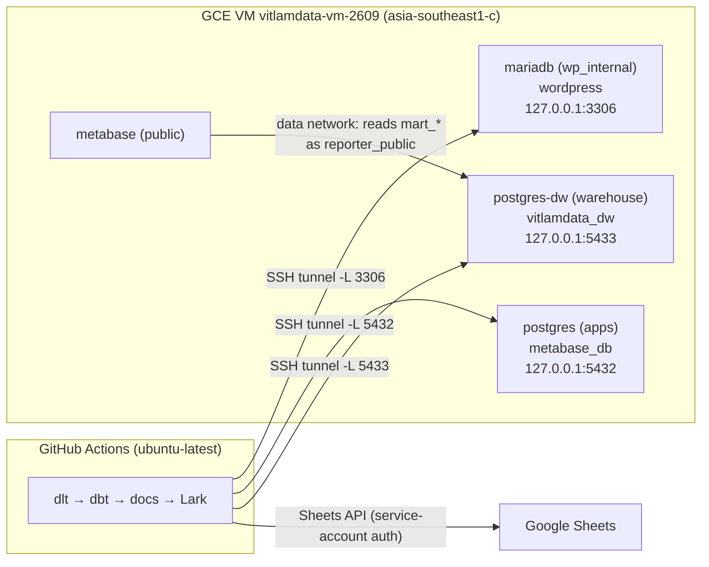
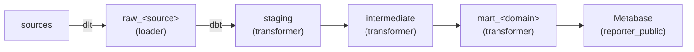

# Architecture — vitlamdata_dbt_postgres

Status: approved design · 2026-10-08 · replaces the dbt project in the `vitlamdata` repo

## 1. Purpose

One dbt project that:

1. feeds the VitLamData Metabase dashboards (Metabase is **public for learners**);
2. is a public portfolio and a worked example of dbt best practices;
3. is a sandbox for learning and experiments.

Success means: a nightly pipeline loads every source, builds tested marts, and alerts on
failure; any PR is validated against real data before merge; no PII ever reaches a schema
Metabase can read; the whole warehouse can be rebuilt from code and sources alone.

### Constraints

- **Code public, data private.** The repo is public. Data, credentials and the VM stay private.
- **Daily batch, small data.** Freshness of one day is enough. Tables are up to a few million rows.
- **The warehouse is not backed up** (infras ADR 0008). Everything in it must be rebuildable
  from sources. Nothing may land in it that has no other copy.
- **One maintainer.**

### Out of scope

- Porting the models of the old `vitlamdata` dbt project. This is a separate sub-project
  with its own spec, after this platform exists.
- Anything on the VM outside the `vitlamdata_dw` database. That belongs to
  `vitlamdata_infras` (see §11).

## 2. System overview



Data flow:



## 3. Sources and extract-load (dlt)

One Python script, `el/load.py`, run with uv. It holds one dlt pipeline per source and takes
a CLI flag to pick a source.

| Source | Where | Reached through | Login | Lands in |
|---|---|---|---|---|
| WordPress + Tutor LMS (sales, enrollments, users) | MariaDB `wordpress` DB | tunnel `localhost:3306` | `dlt_reader` (read-only) | `raw_wordpress` |
| Metabase app DB (questions, dashboards, usage) | app Postgres `metabase_db` | tunnel `localhost:5432` | `dlt_reader` (read-only) | `raw_metabase` |
| Google Sheets | Google Sheets API | HTTPS | `dbt-runner` service account; each sheet is shared with its email | `raw_sheets` |

Write disposition is decided **per table**:

- **merge** (incremental, on the primary key) when the table has a reliable `updated_at`,
  meaning one that changes on every update. Example: `wp_posts.post_modified_gmt`.
- **replace** otherwise. Examples: `wp_users` and `wp_usermeta` have no update timestamp.
  When in doubt, use replace. At this size it is cheap.

dlt keeps its load log in `raw_<source>._dlt_loads`. Merge loads also use a
`raw_<source>_staging` schema. Both schemas are created by Terraform and owned by `loader`.

**Hard deletes are not captured** by merge loads. The `full_refresh` input on the nightly
workflow reloads every source with replace and rebuilds dbt with `--full-refresh`. Run it by
hand after a model logic change, or if source row counts drift. If drift happens, a
delete check gets designed then. That check is not built now.

## 4. Warehouse layout

Database **`vitlamdata_dw`** on `postgres-dw` (Postgres 16). Everything lives in this one
database, because Postgres cannot join across databases and slim CI's `--defer` needs prod
and CI side by side.

| Schema | Owner | Contents |
|---|---|---|
| `raw_wordpress`, `raw_metabase`, `raw_sheets` (+ `*_staging`) | `loader` | dlt output, 1:1 with the source |
| `staging` | `transformer` | dbt views: rename, cast, hash PII |
| `intermediate` | `transformer` | only intermediate models overridden to view/table |
| `mart_<domain>` (e.g. `mart_sales`, `mart_metabase`) | `transformer` | `fact_*` / `dim_*` tables |
| `private` | superuser | `pii_key` table (one row), readable by `transformer` and `developer` |
| `dbt_<user>_*` | that developer | dev builds |
| `ci_pr_<n>_*` | `ci` | PR builds, kept until the PR closes |

## 5. dbt project

### Layout

```
el/load.py
models/01_staging/<source>/      _<source>__sources.yml, _<source>__models.yml, stg_<source>__<entity>.sql
models/02_intermediate/<domain>/ int_<domain>__<verb>.sql
models/03_mart/<domain>/         fact_*.sql, dim_*.sql, _<domain>__models.yml
macros/generate_schema_name.sql
macros/hash_pii.sql
tests/assert_no_pii_in_marts.sql
terraform/
profiles.yml
```

Naming follows the dbt Labs style guide, except marts use `fact_` (not `fct_`).

### Materializations

| Layer | Default | Notes |
|---|---|---|
| `01_staging` | view | |
| `02_intermediate` | ephemeral | a model may override to view/table; it then lands in `intermediate` |
| `03_mart` | table | transaction facts are `incremental`, `incremental_strategy: delete+insert`, with a `unique_key` |

Incremental marts with an enforced contract set `on_schema_change: append_new_columns`
(or `fail`).

### Schema naming

`generate_schema_name` is overridden **for prod only**: prod uses the custom schema name
as written (`staging`, `mart_sales`). Dev and CI keep dbt's default
`<target_schema>_<custom>`, e.g. `dbt_duc_mart_sales` or `ci_pr_12_mart_sales`.

### Profiles

`profiles.yml` is committed. Every connection value comes from `env_var()`, and the
project runs with `--profiles-dir .`. `profiles.yml.example` is deleted.

| Target | User | Schema |
|---|---|---|
| `dev` | personal login, member of `developer` | `dbt_<user>` |
| `ci` | `ci` | `ci_pr_<n>` |
| `prod` | `transformer` | `staging` (overridden per layer) |

Host and port are `localhost:5433`, the local end of the SSH tunnel.

### Packages and lint

- `dbt_utils` only, added when the first macro needs it.
- `sqlfluff` with the jinja templater and the postgres dialect.

## 6. PII

**Rule: PII stops at staging.** Staging replaces every email, phone, name and address with
a keyed hash. No raw PII column exists past staging.

```sql
-- macros/hash_pii.sql
encode(hmac(lower(trim({{ col }})), (select key from private.pii_key), 'sha256'), 'hex')
```

- This is an HMAC-SHA256 with one global secret key. It is deterministic, so the same person
  hashes the same way in WordPress, Metabase and Sheets, and joins still work.
- The key is read **by subquery**, never through `env_var()`. dbt therefore never writes the
  key into `target/`, `manifest.json`, the published docs or the query logs.
- `pgcrypto` is enabled in `vitlamdata_dw` by Terraform.
- The key value lives in Secret Manager as `dw-pii-key`. `terraform.yml` writes it after
  apply with an idempotent `insert … on conflict do nothing`, so a rebuilt warehouse gets
  the same key.
- **Rotating the key changes every hash.** Rotation requires a full refresh of all
  incremental models.
- The singular test `assert_no_pii_in_marts` fails if any column in a `mart_%` schema
  matches `email|phone|name|address` without a `_hash` suffix.

## 7. Roles and privileges

All roles and grants inside `vitlamdata_dw` are Terraform in this repo (§9). `PUBLIC` is
revoked on the database and on the `public` schema.

| Role | Login | Privileges |
|---|---|---|
| `loader` | yes | owns `raw_*` and `raw_*_staging` |
| `transformer` | yes | owns `staging`, `intermediate`, `mart_*`; `SELECT` on `raw_*` and `private.pii_key` |
| `developer` | no (group) | `CREATE` on the database; `SELECT` on `raw_*`, `staging`, `intermediate`, `mart_*` and `private.pii_key`; no write on prod schemas |
| `ci` | yes | member of `developer` |
| personal dev logins | yes | members of `developer` |
| `reporter_public` | yes | `CONNECT`; `USAGE` + `SELECT` on the public marts only. **The list of marts will be decided later.** Metabase connects as this role |

Grants on tables that dbt and dlt create later come from `ALTER DEFAULT PRIVILEGES FOR
ROLE transformer` (and `FOR ROLE loader`). dbt rebuilds a table as a new object on every
run, and default privileges cover each new object. There is no dbt `+grants` config.
Grants live only in Terraform.

Role names are instance-global on `postgres-dw`. They do not clash with the infras roles
(`duck_data*`, `sales*`).

## 8. Environments, CI/CD and orchestration

### Reaching the VM

Every job runs on GitHub-hosted `ubuntu-latest`. Jobs that need a database first
authenticate to GCP with Workload Identity Federation (no key stored in GitHub), then open
the tunnel:

```bash
gcloud compute ssh vitlamdata-vm-2609 --zone asia-southeast1-c --ssh-key-expire-after=30m \
  -- -f -N -o ExitOnForwardFailure=yes \
  -L 3306:127.0.0.1:3306 -L 5432:127.0.0.1:5432 -L 5433:127.0.0.1:5433
```

Do not copy the infras workflow's `--strict-host-key-checking=no`. Keep host-key checking on.
Local dev opens the same tunnel with your own gcloud login.

### GitHub Environments

| Environment | GCP service account | Secrets | Approval |
|---|---|---|---|
| `prod` | `dbt-runner` | `dw-loader`, `dw-transformer`, `dlt-reader-*`, Lark webhook and signing secret | none |
| `ci` | `dbt-runner` | `dw-ci`, `dlt-reader-*` | none |
| `admin` | `dbt-terraform` | `dw-superuser`, role passwords, `dw-pii-key` | none (auto apply) |

WIF bindings are restricted by OIDC subject:

- `dbt-runner` accepts only `repo:ducchetrongminh/vitlamdata_dbt_postgres:environment:prod|ci`.
- `dbt-terraform` accepts only `…:environment:admin`.

Fork PRs receive no OIDC token, so they can never reach a database.

### Workflows

| Workflow | Trigger | Steps |
|---|---|---|
| `nightly.yml` | cron `0 19 * * *` (02:00 ICT); `workflow_dispatch` with a `full_refresh` input | tunnel → `el/load.py` → `dbt source freshness` → `dbt build --target prod` → upload `manifest.json` → `dbt docs generate` → publish to GitHub Pages → Lark (success and failure) |
| `deploy.yml` | push to `main` touching dbt paths | download manifest → `dbt build -s state:modified+ --state prod-state --target prod` → upload manifest |
| `ci.yml` | `pull_request` | `lint`: `sqlfluff lint`, no secrets. `build`: same-repo guard → download manifest → `dbt build -s state:modified+ --defer --state prod-state --target ci` into `ci_pr_<n>_*`. Falls back to a full build when no manifest exists. **Schemas are kept** for review |
| `ci-cleanup.yml` | `pull_request: closed` (merged or not) | same-repo guard → drop `ci_pr_<n>_*` |
| `terraform.yml` | PR touching `terraform/` → plan + PR comment; push to `main` → apply | env `admin`; after apply, write `private.pii_key` |

- `nightly` and `deploy` share `concurrency: prod`, so they never overlap.
- Every DB job carries `if: github.event.pull_request.head.repo.full_name == github.repository`
  where it runs on PRs.
- The prod manifest lives at `gs://vit-lam-data-tfstate/vitlamdata-dbt-postgres/dbt-state/`.
  It is uploaded only by runs that actually built prod. A stale manifest is safe: CI then
  rebuilds a few extra models.
- **Lark alerts are sent by nightly only.** They use a group custom bot with signature
  verification enabled. Everything else reports in GitHub.

## 9. Infrastructure as code (this repo)

`terraform/` uses the `cyrilgdn/postgresql` provider, logged in as the `postgres-dw`
superuser through the tunnel.

- **State:** `gs://vit-lam-data-tfstate`, prefix `vitlamdata-dbt-postgres/warehouse`.
- **Superuser password:** comes from `PGPASSWORD`, which is read from Secret Manager. It is
  never a Terraform input and never in state.
- **Role passwords:** read from Secret Manager as ephemeral values and set through
  `password_wo`, the same pattern infras uses.
- **Resources:** the `vitlamdata_dw` database; the `pgcrypto` extension; the roles in §7;
  all schemas in §4 except the dynamic dev and CI ones; database, schema and
  default-privilege grants.
- **Guard:** every database, role and schema has `lifecycle { prevent_destroy = true }`.
  Apply runs automatically on merge, so this is the only guard against an accidental
  `DROP`. Removing one of these resources takes two steps on purpose: delete the
  `prevent_destroy` line, then delete the resource.

**Not here:** VM, network, GCP service accounts, WIF, Secret Manager secrets and IAM. These
stay in infras `gcp/`. The app Postgres and MariaDB users also stay in infras.

## 10. Data quality and docs

- **Contracts:** `contract: {enforced: true}` on every `03_mart` model. Columns and types
  are declared, and `primary_key` / `not_null` become real Postgres constraints. A breaking
  column change fails the build before Metabase sees it. No contracts on staging or
  intermediate.
- **Generic tests:**
  - staging: `unique` + `not_null` on the PK
  - facts: `relationships` from `fact_*` to `dim_*`
  - status columns: `accepted_values`
  - marts rely on contract constraints for PK, unique and not-null
- **Unit tests** (native dbt ≥1.8): only for tricky logic, such as WordPress/Tutor order and
  enrollment mapping, and incremental filters.
- **Source freshness:** each `raw_<source>._dlt_loads` table is a source with
  `loaded_at_field: inserted_at`. It warns after 26 h and errors after 50 h.
- **PII guard:** see §6.
- **Docs:** `dbt docs` is published to GitHub Pages nightly. It contains SQL and column names
  only, no data, and no PII key (§6).
- **Skipped:** dbt exposures, `dbt-expectations`, Elementary and `store_failures`. Add them
  when needed.

## 11. Work outside this repo (vitlamdata_infras tickets)

1. **MariaDB:** publish on `127.0.0.1:3306` and create a read-only user `dlt_reader` on the
   `wordpress` database.
2. **App Postgres:** create the read-only role `dlt_reader` with `SELECT` on `metabase_db`,
   in infras `postgres/`.
3. **GCP (`gcp/`):**
   - service accounts `dbt-runner` and `dbt-terraform`
   - WIF provider bindings restricted by subject (§8)
   - Secret Manager secrets `dw-superuser`, `dw-loader`, `dw-transformer`, `dw-ci`,
     `dw-reporter-public`, `dw-pii-key`, `dlt-reader-pg`, `dlt-reader-mariadb`
   - per-secret `secretAccessor`
   - permission to `gcloud compute ssh` to the VM
   - write access to the `vitlamdata-dbt-postgres/` prefix of `vit-lam-data-tfstate`
4. **Metabase:** add a database connection to `vitlamdata_dw` as `reporter_public`. This is a
   manual step in the Metabase admin UI.
5. **After cutover:** retire `duck_data`, `sales` and `sales_normalized` from infras
   `postgres/`.

## 12. Security notes

- `gcloud compute ssh` with a metadata key gives the job a **sudo** login on the VM. The
  safeguards are: WIF subject bindings, dedicated service accounts (not infras'
  `GCP_TERRAFORM_SA`), and no OIDC token for fork PRs. Never use `pull_request_target`
  with a checkout of PR code.
- The superuser password reaches only the `admin` environment, from its own secret, never
  from the shared `vitlamdata-env`.
- Metabase is public, so `reporter_public` can read only the listed marts. PII stops at
  staging (§6).

## 13. Open items

| Item | Decide when |
|---|---|
| Which marts `reporter_public` can read | when the first marts exist |
| WordPress/Tutor table list and write disposition per table | implementing `el/load.py` |
| Google Sheets list | implementing `el/load.py` |
| Delete check for hard deletes | only if source row counts drift |
| Lark group and bot | before nightly goes live |
| Porting the old `vitlamdata` models | separate spec |

## 14. Decision log

| Decision | Chosen | Main reason |
|---|---|---|
| EL tool | dlt | one tool for MariaDB, Postgres and Sheets; Python; portfolio value |
| Runner | GitHub-hosted + SSH tunnel | PR code never runs on the VM; clean VMs; no runner to maintain |
| Tunnel auth | `gcloud compute ssh` + WIF | same pattern as infras; keyless |
| Warehouse IaC | Terraform in this repo, new objects only | plan/diff, declarative revoke, drift detection; no state migration |
| GCP resources | infras `gcp/` | one owner for project-level IAM |
| Database | new `vitlamdata_dw`, old ones retired later | clean cutover |
| PII | HMAC with global key in `private.pii_key` | deterministic joins; key never in compiled SQL |
| Prod schema naming | `staging`, `intermediate`, `mart_<domain>` | per-domain grants for public Metabase |
| Facts | incremental `delete+insert` | works on every Postgres version |
| Scheduled full refresh | none; manual `full_refresh` dispatch | dbt-only refresh cannot fix deletes that dlt merge never saw |
| Slim CI | `state:modified+ --defer`, manifest in GCS | fast PR builds; schemas kept until PR closes |
| Deploy | on merge | prod reflects `main` within minutes |
| Terraform apply | automatic on merge, `prevent_destroy` guard | maintainer's choice; plan is visible in the PR |
| Contracts | marts only | protects the public Metabase interface |
